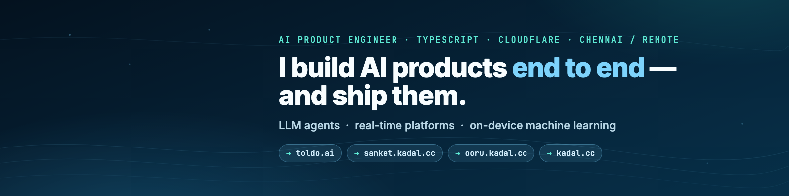
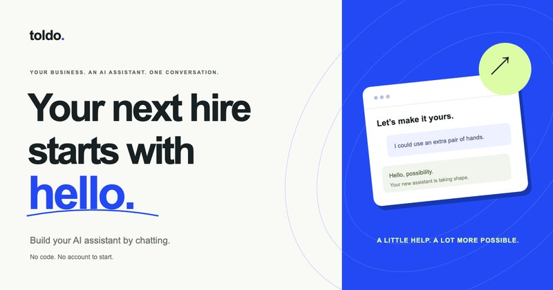
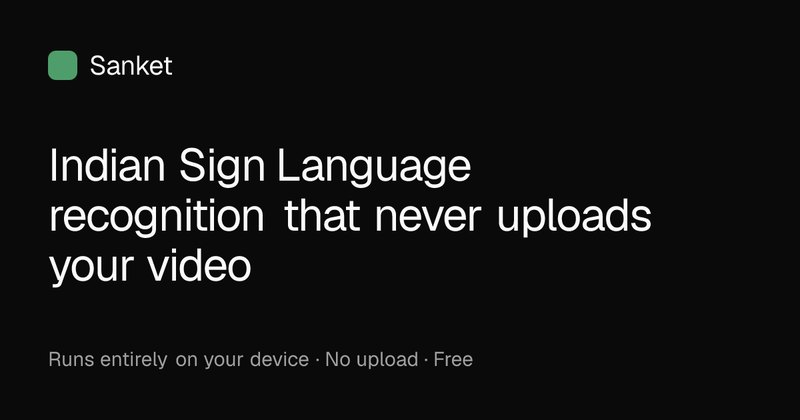
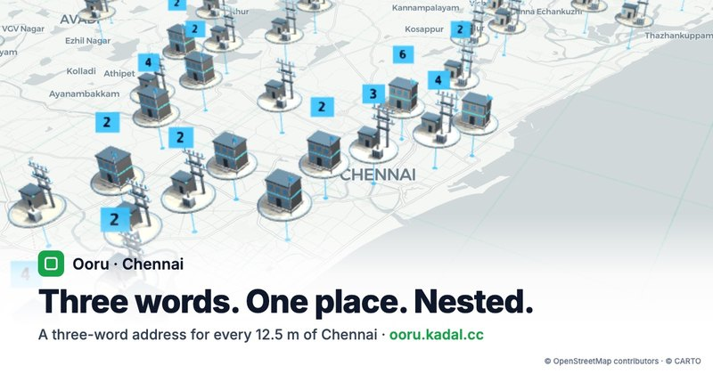
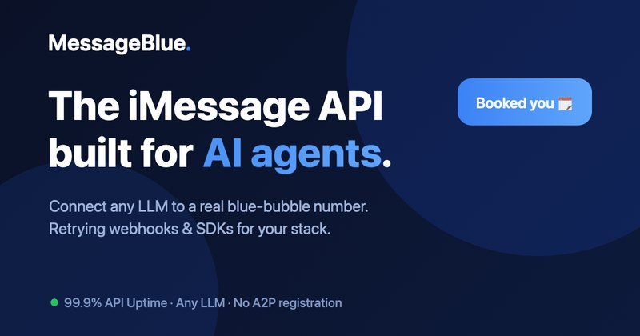
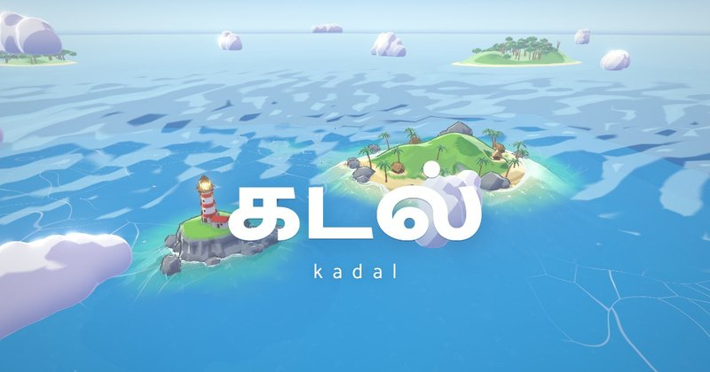

### Hi, I'm Mithunish 👋

I build AI products end to end: the agent, the platform under it, the UI on top. Then I ship them to production.

- **Now:** Senior Software Engineer at Qualkode Technologies, building production AI agents for Blush (VIP matchmaking), the agent layer of [MessageBlue](https://messageblue.ai), and leading engineering on [Toldo](https://toldo.ai).
- **Studying:** M.Tech in Artificial Intelligence at SRM (2025–27).
- **Before:** 8 years across product companies and consulting, including leading a team of 8 building products for US clients.
- **Looking for:** AI product engineering or senior full-stack roles, in Chennai or remote.

### Things I've built, live

<table>
  <tr>
    <td width="50%" valign="top">
      
       <b><a href="https://toldo.ai">Toldo</a></b>: describe the assistant your business needs; Toldo builds it and publishes it to your website, Slack, Telegram or Teams.
       Cloudflare Workers · Durable Objects (Agents SDK) · D1 · React · Stripe
    </td>
    <td width="50%" valign="top">
      
       <b><a href="https://sanket.kadal.cc">Sanket</a></b>: Indian Sign Language recognition that runs fully offline in the browser. A 4.6 MB model at 12.5 ms per window over an 8,165-word vocabulary.
       MediaPipe · PyTorch · self-supervised JEPA · int8 ONNX · Web Workers
    </td>
  </tr>
  <tr>
    <td width="50%" valign="top">
      
       <b><a href="https://ooru.kadal.cc">Ooru</a></b>: a three-word address for every 12.5 m of Chennai, plus a <a href="https://ooru.kadal.cc/outages">citizen power-cut map</a> that resists abuse without logins.
       Next.js on Cloudflare Workers · D1 · deck.gl · MapLibre · Turnstile
    </td>
    <td width="50%" valign="top">
      
       <b><a href="https://messageblue.ai">MessageBlue</a></b> (agent layer): per-app RAG, memory, voice-note replies, and MCP tool integrations behind confirmation gates.
       TypeScript · MongoDB Atlas Vector Search · OpenRouter · Slack &amp; Teams
    </td>
  </tr>
  <tr>
    <td width="50%" valign="top">
      
       <b><a href="https://kadal.cc">kadal.cc</a></b>: a scroll-dive through a toon sea that links my apps. 54 procedurally generated Blender assets in ~1.3 MB.
       three.js · TypeScript · Blender CLI
    </td>
    <td width="50%" valign="top">
      <b><a href="https://deck.kadal.cc">Deck</a></b>: my own presentation engine. MDX slides with a live audience room: presenter sync, follow/roam, polls, quizzes and drawing; exports to PDF, PNG and PPTX.
       React · Vite · Durable Objects with hibernating WebSockets
        <b>Production work for Blush</b>: AI agents that chat with clients, coordinate dates and book calls, plus the CRM behind them. One fix took a booking query from 2.18M documents examined to 1,684.
    </td>
  </tr>
</table>

Most of my code lives in private repositories (employer and coursework), which is why the repo list here is short. I'm happy to walk through any of it.

### How I work

AI-native: I run coding agents in parallel behind hard verification gates (typecheck, tests, real-browser checks), so I ship at the pace of a small team without lowering the bar.

### Stack

TypeScript · React · Node / Bun · Hono · Effect · PostgreSQL · Redis · Cloudflare (Workers, D1, Durable Objects, R2) · LLM APIs, agents & evals · PyTorch · ONNX · Python · Rust

### Reach me

[LinkedIn](https://www.linkedin.com/in/pmithunish/) · [pmithunish@gmail.com](mailto:pmithunish@gmail.com) · [kadal.cc](https://kadal.cc)
